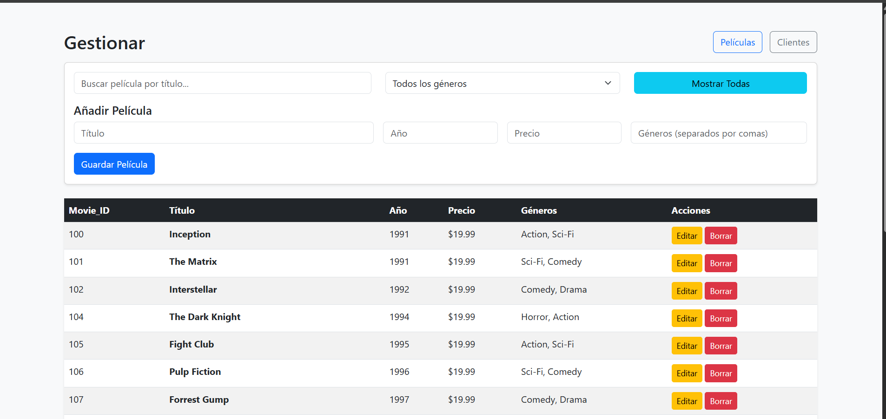

Este proyecto permite ver una lista de películas y clientes ademas de poder filtrar, agregar, editar o eliminar los datos. Las palículas también pueden ser filtradas por género. 

Cómo correrlo desde cero:
- Correr npm install.
- Crear un archivo .env en la raíz con MONGODB_URI y MONGODB_DB. Asigna el valor de la URL de Atlas y el nombre de la base de datos respectivamente.
- Para semillar datos, coloca el contenido de seed en un playground de tu DB de Atlas (requiere la extensión de MongoDB para VSC).

Stack utilizado
- Backend: Node.js con Express para la API inicial ya que es el que estoy acostumbrado a usar.
- Frontend: HTML/CSS/JavaScript para una interfaz simple y ligera.
- Base de datos: MongoDB Atlas ya que fue lo recomendado.

